<!-- _class: lead -->
<!-- _header: "" -->
<!-- _footer: "Anonymized team submission" -->

# Entering the Organic Hass Avocado Market With Disciplined Pilot Economics

West Valley Fresh Distribution Company  
2026 IMA Student Case Competition

  20,000 organic units
  40 city markets in supplied data
  2019 to June 2025 HAB data

Prepared as an anonymized submission. The deck is designed to stand alone without speaker notes and focuses on profitability, volatility, and disciplined market entry.

---

# A selective 5-city pilot is the strongest entry path for the 20,000-unit organic order

  

    <h3>Recommendation</h3>
    
5-city launch

    
Seattle, Boise, Portland, Spokane, and San Diego maximize expected profit under the June 2026 pricing assumption.

  

  

    <h3>Base-case economics</h3>
    
$13.7k avg profit

    
The selected cities pair premium June pricing with manageable miles, producing a top-five average margin of 69.8%.

  

  

    <h3>Why it is resilient</h3>
    
Same 5 cities

    
The recommendation does not change when shipping costs move up 50% or down 50%.

  

Model note: each city is scored as a comparable 20,000-unit scenario using June 2025 retail price as the June 2026 proxy.

---

<!-- _class: compact -->

# Seasonality creates a timing gap between volume and price

  

Volume arrives early. Organic monthly volume peaks in <strong>January</strong>, conventional peaks in <strong>May</strong>, and both soften into <strong>November</strong>.

  

  

Price crests later. Both organic and conventional monthly prices peak in <strong>July</strong> and bottom in <strong>February</strong>.

  

The market absorbs more units before it offers peak pricing, so timing affects margin capture, promotions, and inventory allocation.

---

# Organic is growing faster than the total Hass market, but it remains a small share

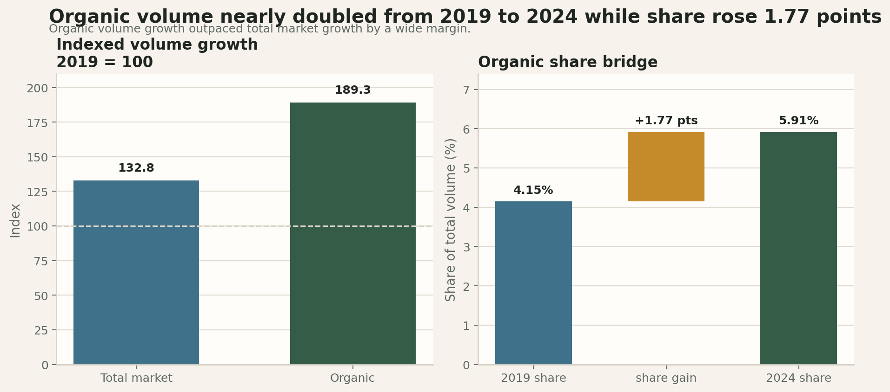

---

# The pilot screen should be price support, organic readiness, and route efficiency

  

    

      <h3>Price support</h3>
      
$2.09 to $2.66

      
The five selected cities are also the five highest-price June 2025 organic markets in the model.

    

  

  

    

      <h3>Organic readiness</h3>
      
Seattle leads 5 of 7

      
Organic adoption is uneven by city, so total sales scale alone is not enough to pick the best launch markets.

    

  

  

    

      <h3>Route efficiency</h3>
      
$813 to $1,024

      
Even after a 50% freight increase, the recommended cities lose only about $0.8k to $1.0k each and keep the same ranking.

    

  

This deck tests those three filters against sales leadership, organic mix, profitability, freight sensitivity, and seasonality.

---

<!-- _class: compact -->

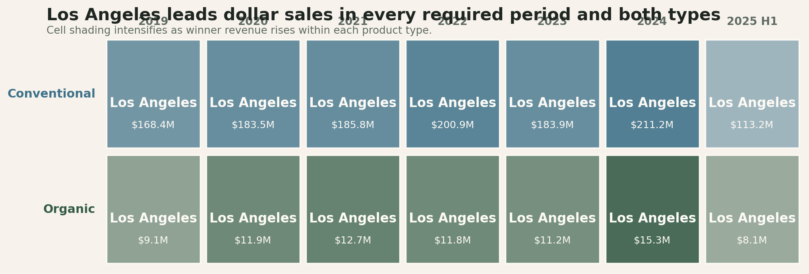

---

<!-- _class: compact -->

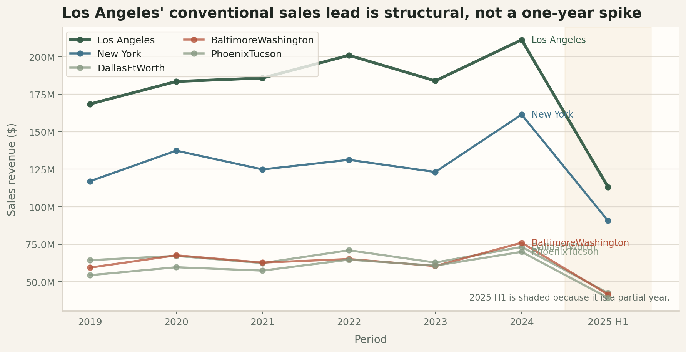

---

<!-- _class: compact -->

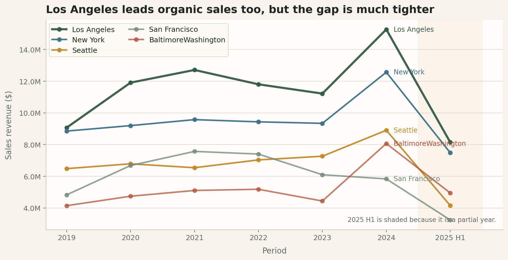

---

<!-- _class: compact -->

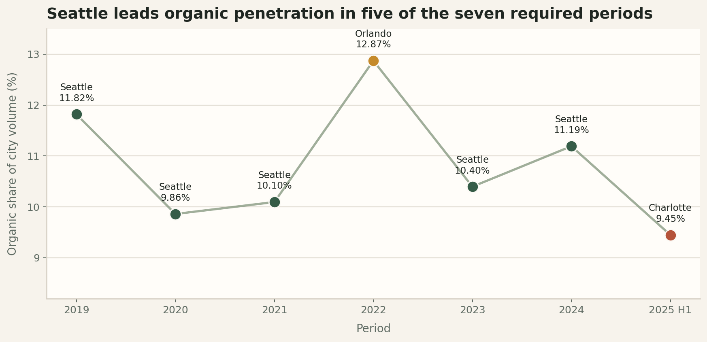

---

<!-- _class: compact -->

---

<!-- _class: compact -->

---

<!-- _class: compact -->

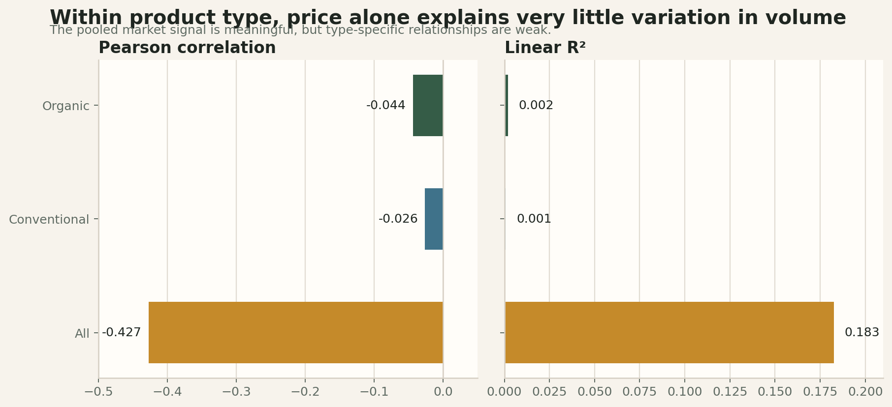

---

<!-- _class: compact -->

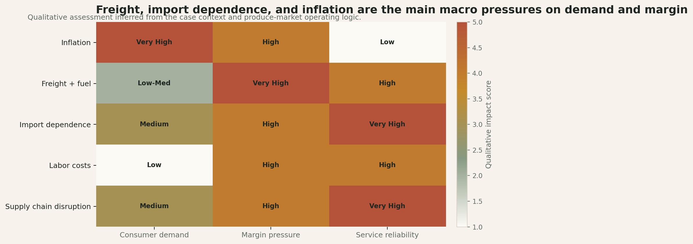

---

<!-- _class: compact -->

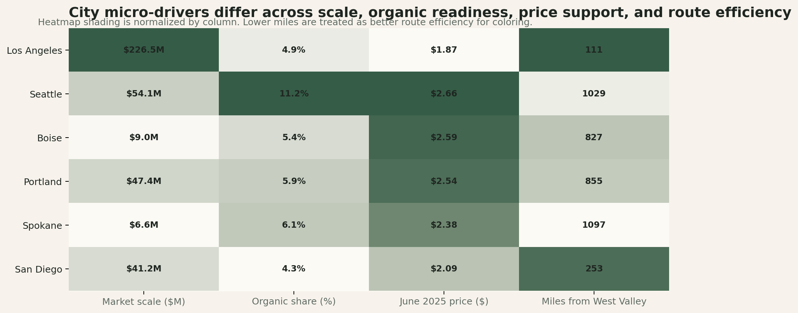

---

<!-- _class: compact -->

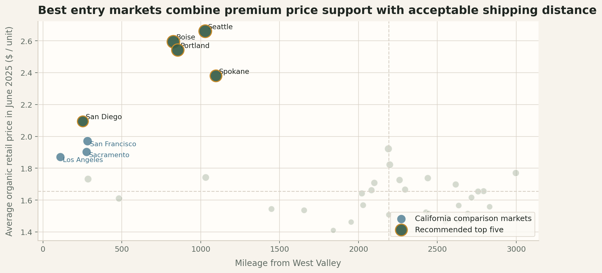

---

<!-- _class: compact -->

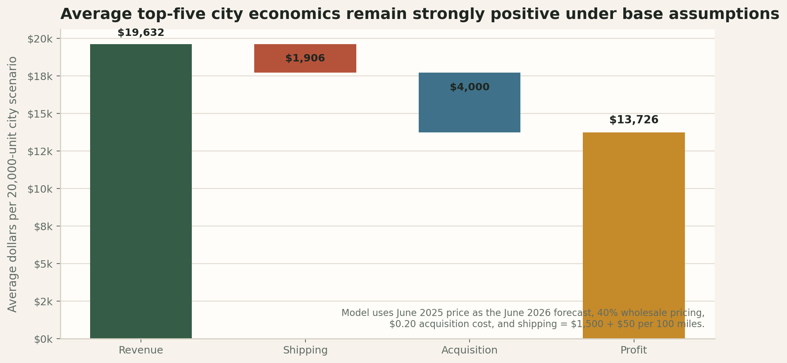

---

<!-- _class: compact -->

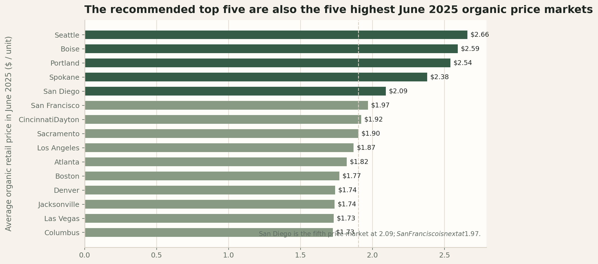

---

<!-- _class: compact -->

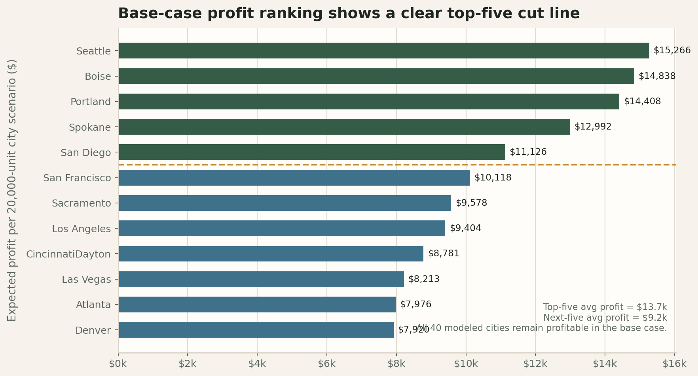

---

<!-- _class: compact -->

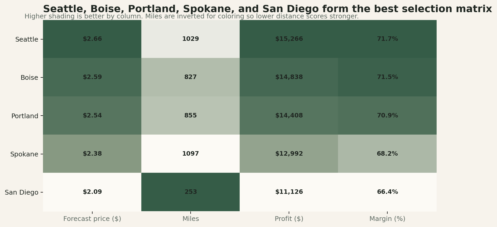

---

<!-- _class: compact -->

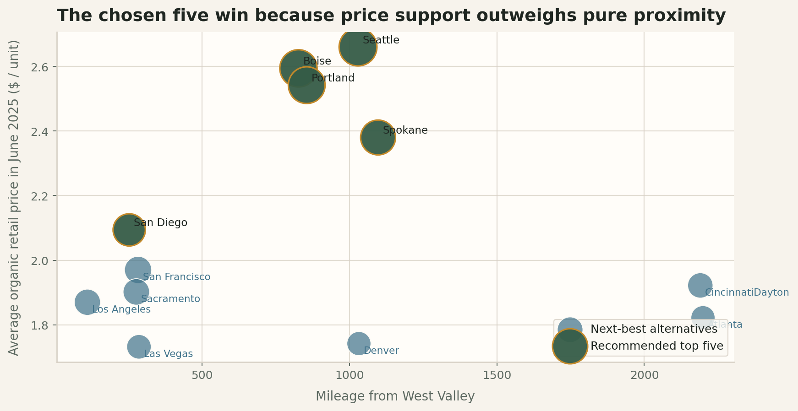

---

<!-- _class: compact -->

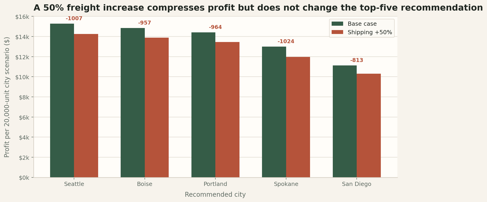

---

<!-- _class: compact -->

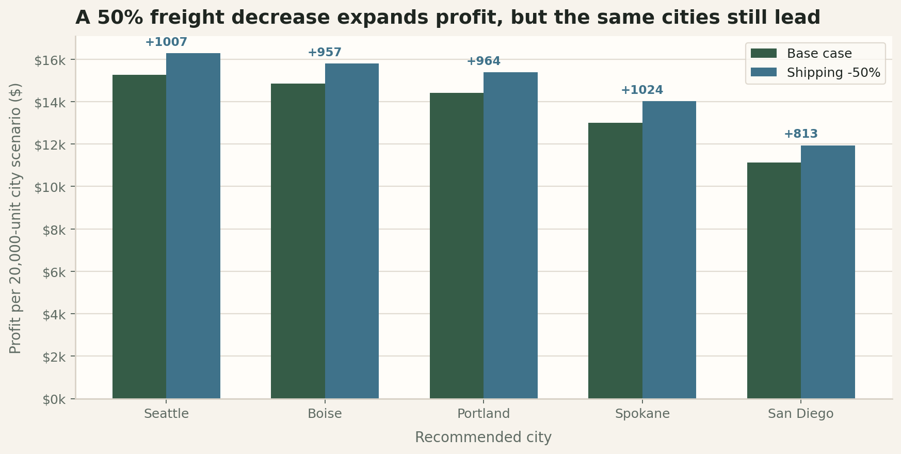

---

<!-- _class: compact -->

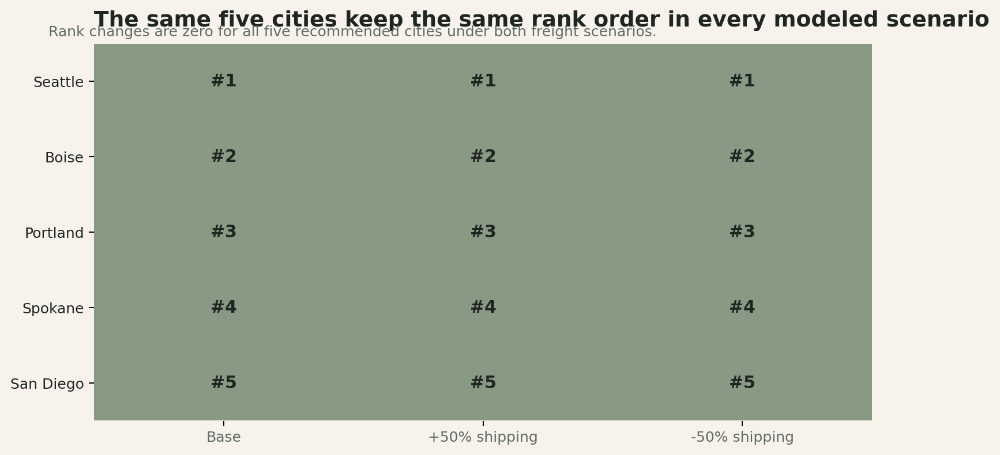

---

<!-- _class: compact -->

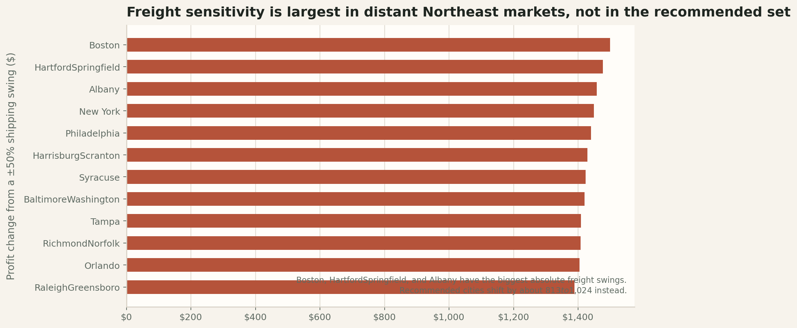

---

<!-- _class: compact -->

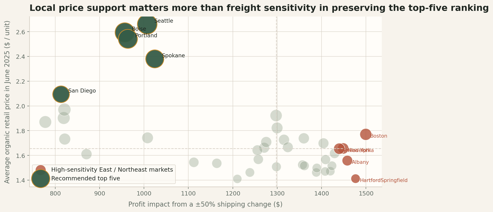

<!-- Slides 26-40 to be added in the next build blocks. -->
