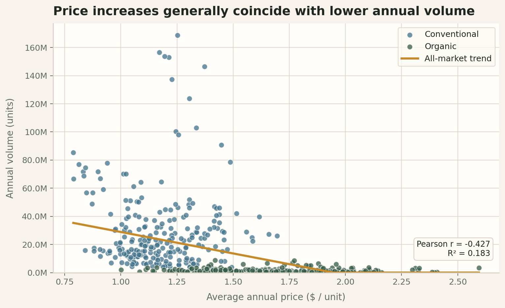
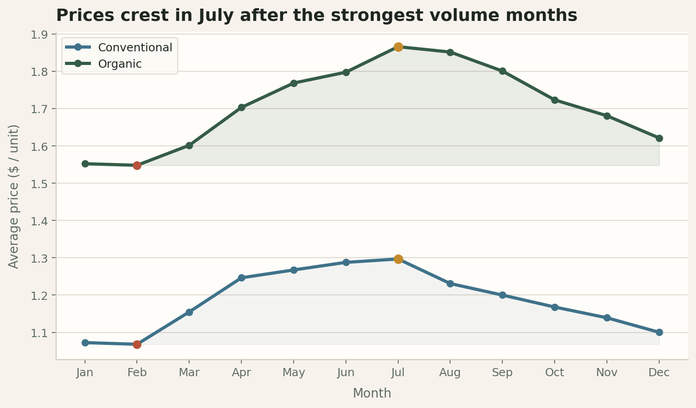
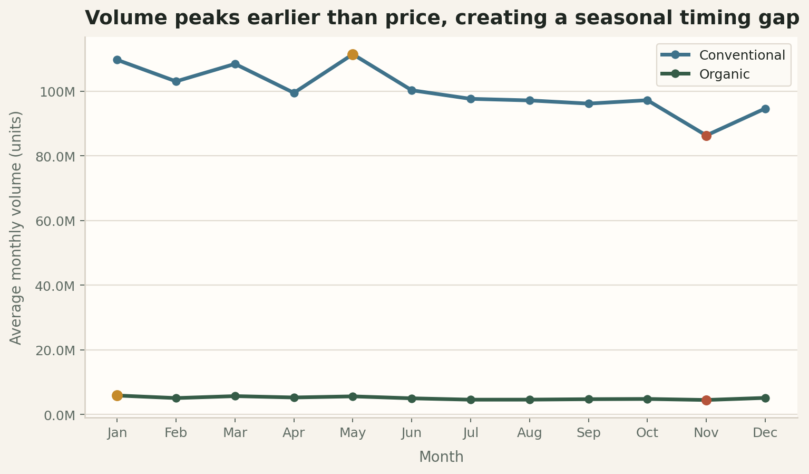

<!-- _class: lead -->

# West Valley Can Enter Organically With Disciplined Pilot Economics

**Executive Avocado** is the reusable Marp theme for an anonymized, data-first case competition deck.

  Light background
  Executive + Quant
  Anonymized submission

Use this cover treatment for the title slide, executive recommendation, and final close. Keep imagery abstract and avoid school branding, logos, or busy stock photography.

---

<!-- _class: section -->

## Theme Structure

# Section dividers are bold, minimal, and easy to scan

Subsections should use one statement, one support line, and no extra decoration.

---

# Recommendation slides should read like decisions, not topics

  

    <h3>Primary recommendation</h3>
    
5-city pilot

    
Lead with the answer, then support it with three proof points.

  

  

    <h3>Case framing</h3>
    
20,000 units

    
Use one large number or insight per card instead of dense paragraphs.

  

  

    <h3>Decision tone</h3>
    
High confidence

    
Keep color meaning fixed across all 40 slides so judges learn it once.

  

> Green signals recommendation and stable performance. Rust is reserved for downside risk and stress scenarios. Gold highlights only the most important callout on the slide.

---

# Chart slides should pair one visual with one sharp readout

  

Pooled 2019-2024 city-year-type observations show a moderate negative price-volume relationship. Use the image as the hero and keep the annotation light.

  

  

    

      <h3>Key takeaway</h3>
      
r = -0.427

      
Higher prices generally align with lower annual volume, but the relationship weakens within type.

    

    

      Organic = green
      Total / compare = blue
      Stress case = rust
    

    
Titles should state the conclusion first. The body only needs a visual, one key statistic, and a short interpretation.

  

---

# Tables should feel clean enough for judges to audit quickly

| City | Forecast Retail Price | Mileage | Expected Profit | Margin |
| --- | ---: | ---: | ---: | ---: |
| Seattle | $2.66 | 1,029 | $15,265.50 | 71.74% |
| Boise | $2.59 | 827 | $14,838.50 | 71.50% |
| Portland | $2.54 | 855 | $14,408.50 | 70.85% |
| Spokane | $2.38 | 1,097 | $12,991.50 | 68.23% |
| San Diego | $2.09 | 253 | $11,125.50 | 66.41% |

  Base case
  Green header
  Muted zebra striping

Use tables when the audience needs exact numbers. Keep them compact, left-aligned where possible, and avoid coloring every cell.

---

# Sensitivity slides should emphasize stability before variance

  

    

      <h3>Shipping +50%</h3>
      
No ranking change

      
Rust communicates pressure on margins, not a broken recommendation.

      

        Margin compression
      

    

  

  

    

      <h3>Shipping -50%</h3>
      
No ranking change

      
Blue communicates upside improvement while preserving the same city order.

      

        Margin expansion
      

    

  

> In this case, the top five cities remain unchanged across the base, +50%, and -50% logistics scenarios. The visual goal is to show resilience, not just bigger or smaller bars.

---

# Seasonality slides can use the same frame with different monthly stories

  

Price peaks in July and bottoms in February. Gold is the right accent for peak-season callouts.

  

  

Organic volume peaks in January and bottoms in November. Keep both slides visually parallel so the comparison is instant.

  

---

# Implementation slides should feel operational, not decorative

  

    <h3>Phase 1</h3>
    
Pilot

    
Launch the 5-city test, confirm realized margin, and tighten routing assumptions.

  

  

    <h3>Phase 2</h3>
    
Scale

    
Expand retailer coverage in the best-performing markets and lock seasonal allocation rules.

  

  

    <h3>Phase 3</h3>
    
Optimize

    
Refine pricing, cold-chain reliability, and grower partnership terms as the market response stabilizes.

  

---

<!-- _class: appendix -->

## Appendix Treatment

# Appendix slides keep the same palette but strip back the flourish

Use this darker divider before detailed backup tables, formulas, and assumptions so the audience knows they have moved from narrative to support material.
